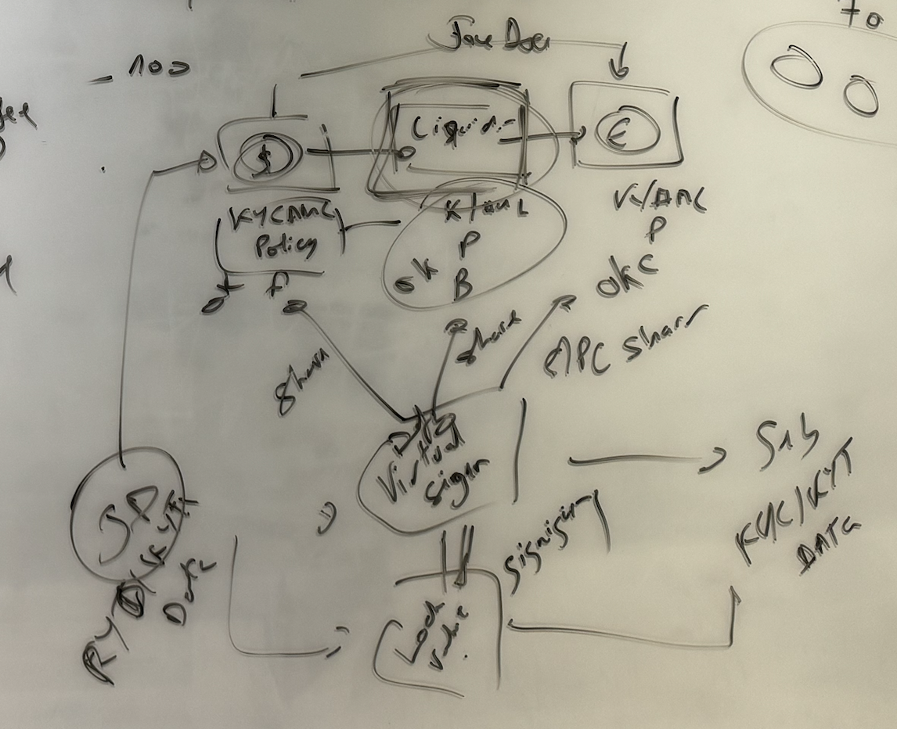

# Milestone 5

### Deliverables

- Provide comprehensive documentation detailing the MVP functionality and integration.
- Finalize and publish detailed project documentation.
- Ensure all code is licensed under open source licenses and available on GitHub.

### Video demo

The video demo will showcase the working virtual signing in action.

- User A will initiate a transaction, to send some values to User B.
- Based on the transaction information, the virtual signer will query relevant policy contracts to determine if the transaction is valid. If the transaction is valid, each policy will sign the transaction.
- In order to check if the transaction is valid, each policy need to perform zero knowledge proof to enquire the transaction's and user's information.
- Once all the policies have signed the transaction, the transaction will be submitted to the Cardano network.